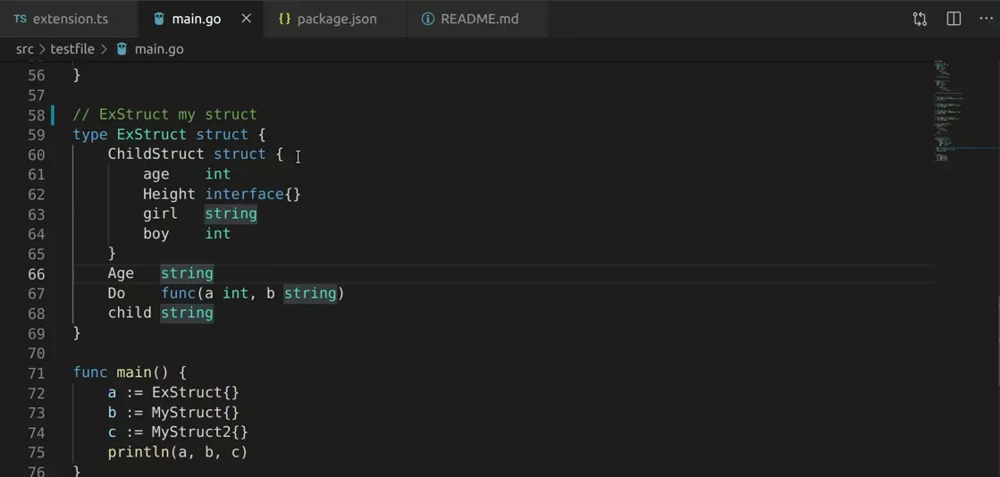

# go-quickly-generator README

the extension is easy to generate getter or setter .

[repository](https://github.com/474420502/go-quickly-generator)

[issue](https://github.com/474420502/go-quickly-generator/issues)

